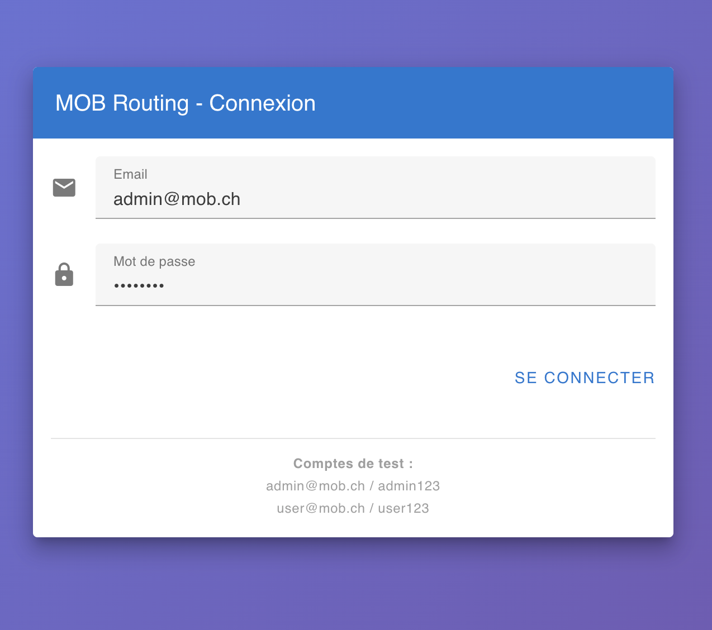
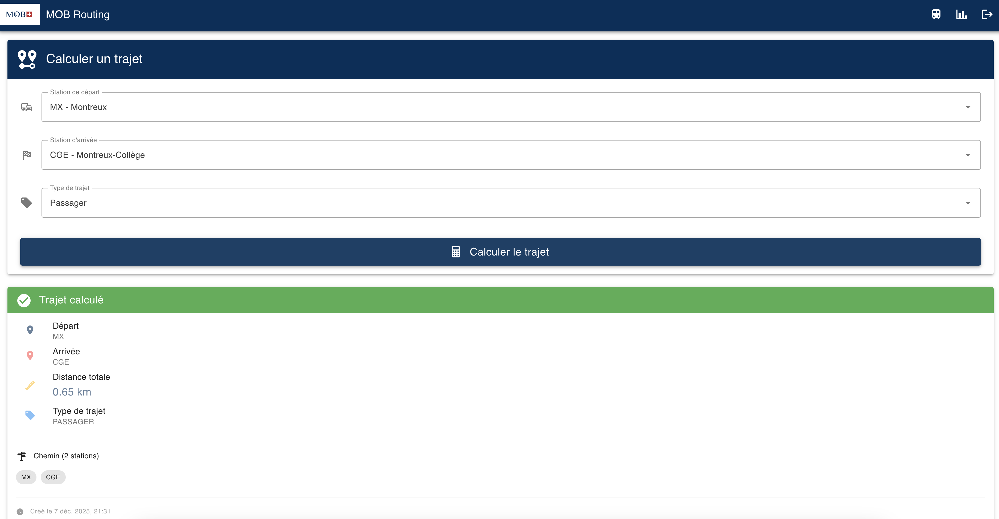
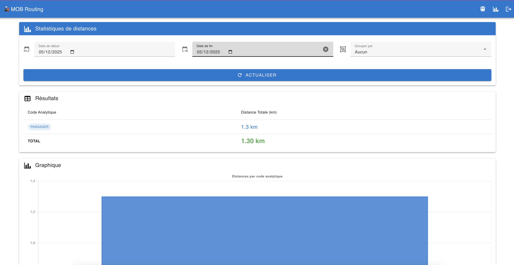

# 🚂 MOB Railway Route Calculator

> Système fullstack de calcul d'itinéraires ferroviaires utilisant l'algorithme de Dijkstra pour le réseau Montreux-Oberland-Bernois (MOB)

[](https://github.com/baherdev/MOB-defi-fullstack/actions/workflows/ci.yml)
[](https://www.docker.com/)
[](LICENSE)

---

## 📸 Aperçu

### Page de Connexion

*Interface d'authentification sécurisée avec JWT*

### Interface de Calcul d'Itinéraire

*Calculez le chemin le plus court entre deux stations du réseau MOB avec l'algorithme de Dijkstra*

### Dashboard Statistiques

*Visualisez les statistiques de distance par code analytique avec des graphiques interactifs*

---

## ✨ Fonctionnalités

- 🗺️ **Calcul d'itinéraire optimal** - Algorithme de Dijkstra pour trouver le chemin le plus court
- 🔐 **Authentification JWT** - Système de connexion sécurisé
- 📊 **Dashboard statistiques** - Graphiques interactifs avec Chart.js
- 🚀 **API REST documentée** - OpenAPI/Swagger pour une intégration facile
- 🐳 **Docker ready** - Déploiement en une commande
- ✅ **Tests automatisés** - 22 tests (PHPUnit + Vitest) avec 85% de couverture
- 🔄 **CI/CD complet** - GitHub Actions avec 8 jobs automatisés

---

## 🏗️ Architecture

### Stack Technique

**Backend:**
- PHP 8.4 + Symfony 7.1
- MySQL 8.0
- API Platform
- LexikJWTAuthenticationBundle

**Frontend:**
- Vue.js 3 (Composition API)
- TypeScript 5
- Vuetify 3 (Material Design)
- Vite
- Chart.js

**Infrastructure:**
- Docker + Docker Compose
- Nginx
- GitHub Actions (CI/CD)
- Traefik (Production HTTPS)

### Réseau Ferroviaire

Le système modélise **44 stations** du réseau MOB avec leurs connexions réelles :
- Ligne Montreux - Zweisimmen
- Ligne Zweisimmen - Lenk
- 88 segments bidirectionnels
- Distances réelles en kilomètres

---

## 🚀 Installation Rapide

### Prérequis

- **Docker** >= 20.10
- **Docker Compose** >= 2.0
- Ports disponibles : `3000` (frontend), `8000` (backend), `3306` (database)

### Démarrage en 3 commandes

```bash
# 1. Cloner le projet
git clone https://github.com/baherdev/MOB-defi-fullstack.git
cd MOB-defi-fullstack

# 2. Lancer avec Docker
docker compose up -d

# 3. Attendre 30 secondes et ouvrir
open http://localhost:3000
```

### Comptes de test

| Email | Mot de passe | Rôle |
|-------|--------------|------|
| `admin@mob.ch` | `admin123` | Admin |
| `user@mob.ch` | `user123` | User |
| `test@mob.ch` | `test123` | User |

---

## 📖 Utilisation

### 1. Connexion

Connectez-vous avec un des comptes de test ci-dessus.

### 2. Calculer un trajet

1. Sélectionnez une **station de départ** (ex: Montreux)
2. Sélectionnez une **station d'arrivée** (ex: Gstaad)
3. Choisissez un **code analytique** (PASSAGER, FRET, etc.)
4. Cliquez sur **"Calculer l'itinéraire"**

Le système affiche :
- ✅ Distance totale en kilomètres
- ✅ Liste ordonnée des stations
- ✅ Détail de chaque segment

### 3. Consulter les statistiques

Cliquez sur **"Statistiques"** dans le menu pour voir :
- Graphiques de distance par code analytique
- Tableau détaillé des trajets calculés
- Filtres par date et type

---

## 🧪 Tests

### Backend (PHPUnit)
```bash
# Lancer les tests
docker compose exec backend php bin/phpunit

# Avec couverture de code
docker compose exec backend php bin/phpunit --coverage-text
```

### Frontend (Vitest)
```bash
# Lancer les tests
docker compose run --rm frontend-test npm test

# Avec couverture de code
docker compose run --rm frontend-test npm run test:coverage
```

### Script de tests générique de base

```bash
# Ou via le script de test
./test-deployment.sh
```

### Couverture de tests

- **Backend** : 12 tests (PHPUnit) - unitaires et d'intégration
- **Frontend** : 10 tests (~76% de couverture)
- **Tous les tests passent** dans le CI/CD

---

## 🔧 Développement

### Structure du projet

```
MOB-defi-fullstack/
├── mob-routing-api/          # Backend Symfony
│   ├── src/
│   │   ├── Entity/           # Entités Doctrine
│   │   ├── Service/          # RoutingService (Dijkstra)
│   │   ├── Controller/       # API REST
│   │   └── DataFixtures/     # Données de test
│   ├── tests/                # Tests PHPUnit
│   └── Dockerfile
│
├── mob-routing-frontend/     # Frontend Vue.js
│   ├── src/
│   │   ├── components/       # Composants Vue
│   │   ├── composables/      # useAuth
│   │   ├── services/         # API client
│   │   └── router/           # Vue Router
│   ├── src/__tests__/        # Tests Vitest
│   └── Dockerfile
│
├── docs/                     # Documentation
│   ├── ARCHITECTURE.md
│   ├── DESIGN.md            # Conception des entités
│   ├── DEPLOYMENT.md
│   └── PRODUCTION.md
│
└── docker-compose.yml        # Orchestration
```

### Commandes utiles

```bash
# Rebuild complet
docker compose down -v
docker compose build --no-cache
docker compose up -d

# Voir les logs
docker compose logs -f backend
docker compose logs -f frontend

# Accéder aux conteneurs
docker compose exec backend bash
docker compose exec frontend sh

# Nettoyer
docker compose down -v
docker system prune -a
```

---

## 📚 Documentation

### Guides Complets

- 🏛️ **[Architecture](docs/ARCHITECTURE.md)** - Architecture technique du système
- 🎨 **[Design](docs/DESIGN.md)** - Conception des entités et algorithme de Dijkstra
- 🚀 **[Deployment](docs/DEPLOYMENT.md)** - Guide de déploiement détaillé
- 🔒 **[Security](docs/SECURITY.md)** - Bonnes pratiques de sécurité
- 🔑 **[JWT Setup](docs/JWT-SETUP.md)** - Configuration de l'authentification
- 🌐 **[Production](docs/PRODUCTION.md)** - Déploiement production avec HTTPS
- 📜 **[Git History](docs/GIT-HISTORY.md)** - Explication de l'historique Git reconstruit

### API Documentation

L'API REST est documentée avec OpenAPI/Swagger :

```bash
# Voir la spec OpenAPI
open http://localhost:8000/api/docs

# Ou consulter le fichier
cat openapi.yml
```

**Endpoints principaux :**

| Méthode | Endpoint | Description |
|---------|----------|-------------|
| `POST` | `/api/login` | Authentification JWT |
| `POST` | `/api/v1/routes` | Calculer un itinéraire |
| `GET` | `/api/v1/stats/distances` | Statistiques de distance |

---

## 🎯 Algorithme de Dijkstra

Le système utilise l'algorithme de Dijkstra pour calculer le chemin le plus court :

```
1. Initialiser distances[départ] = 0, autres = ∞
2. File de priorité avec station de départ
3. Pour chaque station extraite :
   - Explorer les voisins via NetworkSegment
   - Mettre à jour distances si chemin plus court trouvé
4. Reconstruire le chemin depuis la destination
5. Retourner {distance, path}
```

**Complexité :** O((V + E) log V)  
**Performance :** ~44 stations, ~88 segments → Calcul instantané (<10ms)

👉 Voir [docs/DESIGN.md](docs/DESIGN.md) pour la conception détaillée

---

## 🔐 Sécurité

- ✅ **Authentification JWT** avec clés RSA
- ✅ **CORS** configuré pour localhost en dev
- ✅ **Validation des entrées** côté backend
- ✅ **HTTPS** en production avec Let's Encrypt
- ✅ **Security headers** (HSTS, X-Frame-Options, etc.)
- ✅ **Scan de vulnérabilités** avec Trivy dans le CI

👉 Voir [docs/SECURITY.md](docs/SECURITY.md) pour les détails

---

## 🚀 CI/CD

Le projet inclut un pipeline GitHub Actions complet :

### 8 Jobs Automatisés

1. ✅ **Backend Tests** - PHPUnit avec couverture
2. ✅ **Backend Lint** - PHPStan niveau 6
3. ✅ **Frontend Tests** - Vitest
4. ✅ **Frontend Lint** - ESLint
5. ✅ **Frontend Build** - Vérification du build production
6. ✅ **Security Scan** - Trivy vulnerability scanner
7. ✅ **Docker Compose E2E** - Tests d'intégration avec JWT
8. ✅ **Publish Images** - Publication sur GitHub Container Registry

### Workflow

```
Push → Tests → Lint → Build → Security → E2E → Deploy (main only)
```

---

## 🌐 Déploiement Production

⚠️ **Important** : La configuration de production fournie (Traefik + Let's Encrypt) est un **exemple de référence** et **n'a pas été testée en environnement réel**. Elle nécessite des tests approfondis, une adaptation à votre infrastructure et un audit de sécurité avant toute utilisation en production.

### Avec HTTPS automatique (Traefik + Let's Encrypt)

```bash
# 1. Configurer les variables d'environnement
cp .env.prod.example .env.prod
nano .env.prod

# 2. Modifier docker-compose.prod.yml avec votre domaine

# 3. Lancer en production (après tests et validation)
docker compose -f docker-compose.prod.yml up -d
```

👉 Voir [docs/PRODUCTION.md](docs/PRODUCTION.md) pour le guide complet

⚠️ **Consultez également [docs/SECURITY.md](docs/SECURITY.md) pour les recommandations de sécurité essentielles avant tout déploiement en production.**

---

## 🤝 Contribution

Les contributions sont les bienvenues ! Pour contribuer :

1. Fork le projet
2. Créer une branche (`git checkout -b feature/AmazingFeature`)
3. Commit les changements (`git commit -m 'Add some AmazingFeature'`)
4. Push vers la branche (`git push origin feature/AmazingFeature`)
5. Ouvrir une Pull Request

### Guidelines

- ✅ Suivre les conventions de code (PSR-12 pour PHP, Vue.js style guide)
- ✅ Ajouter des tests pour les nouvelles fonctionnalités
- ✅ Mettre à jour la documentation
- ✅ S'assurer que le CI passe

---

## 📝 License

Ce projet est sous licence MIT. Voir le fichier [LICENSE](LICENSE) pour plus de détails.

---

## 👨‍💻 Auteur

**Baher Rais**

- Email: [baher.rais@iec.ch](mailto:baher.rais@iec.ch)
- GitHub: [@baherdev](https://github.com/baherdev)
- YouTube: [@Freelancemodule](https://www.youtube.com/@Freelancemodule/playlists)

---

## 🙏 Remerciements

- **MOB (Montreux-Oberland-Bernois)** pour les données du réseau ferroviaire
- **Anthropic Claude** pour l'assistance au développement
- La communauté **Symfony** et **Vue.js**

---

## 🤖 Développement Assisté par IA

Ce projet a été développé avec l'assistance de **Claude.ai (Anthropic)** dans le cadre d'un défi technique fullstack.

### Répartition des Compétences

**Développeur (Baher Rais) :**
- ✅ **Expertise Backend Symfony** : Architecture, entités, services
- ✅ **Connaissances Frontend React** : Concepts de composants et state management
- ✅ **Conception algorithmique** : Compréhension et adaptation de l'algorithme de Dijkstra
- ✅ **Architecture système** : Décisions de conception des entités et du modèle de données
- ✅ **Validation et tests** : Vérification du fonctionnement, débogage, propositions de solutions
- ✅ **Direction du projet** : Définition des besoins, priorisation, décisions techniques

**Assistance IA (Claude.ai) :**
- 🤖 **Vue.js / TypeScript** : Génération du code frontend (nouveau framework pour le développeur)
- 🤖 **CI/CD GitHub Actions** : Configuration du pipeline (en collaboration)
- 🤖 **Docker / DevOps** : Optimisation des Dockerfiles et docker-compose
- 🤖 **Documentation** : Rédaction des fichiers Markdown
- 🤖 **Débogage** : Assistance dans la résolution de problèmes techniques
- 🤖 **Best practices** : Suggestions d'amélioration du code

### Méthodologie de Collaboration

Le développement s'est déroulé comme un **binômage humain-IA** :

1. **Conception** : Discussion des besoins et de l'architecture
2. **Implémentation** : Génération de code avec révision humaine
3. **Itération** : Tests, corrections, améliorations
4. **Validation** : Vérification manuelle du fonctionnement
5. **Documentation** : Rédaction collaborative

**Points clés :**
- 💡 L'IA a accéléré l'apprentissage de Vue.js
- 🔍 Le développeur a validé chaque décision technique
- 🐛 Le débogage a été un effort collaboratif
- 📚 La documentation a été enrichie par les deux parties

### Transparence

Ce projet démontre qu'un développeur expérimenté dans certaines technologies (Symfony, React) peut, avec l'assistance d'une IA :
- Apprendre rapidement de nouveaux frameworks (Vue.js)
- Mettre en place des pratiques DevOps modernes (CI/CD)
- Produire une application complète et de qualité professionnelle

L'IA est un **outil d'assistance**, pas un remplacement. La compréhension technique, les décisions d'architecture et la validation restent du ressort du développeur.

---

## 📊 Statistiques du Projet

- **Lignes de code** : ~8,000+ (Backend + Frontend)
- **Tests** : 22 tests automatisés (12 backend + 10 frontend)
- **Couverture** : ~76% (Frontend), Backend non mesuré
- **Performance** : Calcul d'itinéraire < 10ms
- **CI/CD** : 8 jobs automatisés

---

## 🗺️ Améliorations Futures

### Tests et Qualité
- [ ] Augmenter la couverture de tests frontend (objectif: 90%)
- [ ] Ajouter la mesure de couverture backend
- [ ] Tests end-to-end (Playwright ou Cypress)
